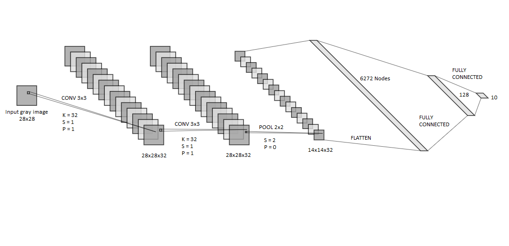
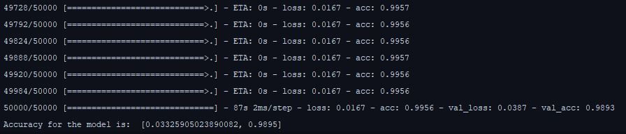
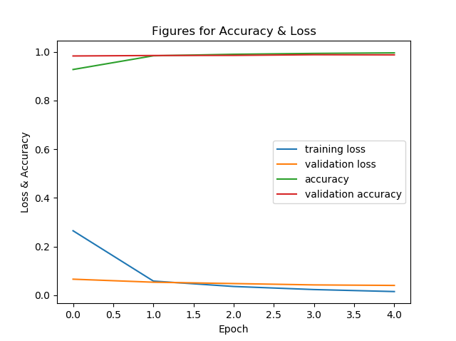
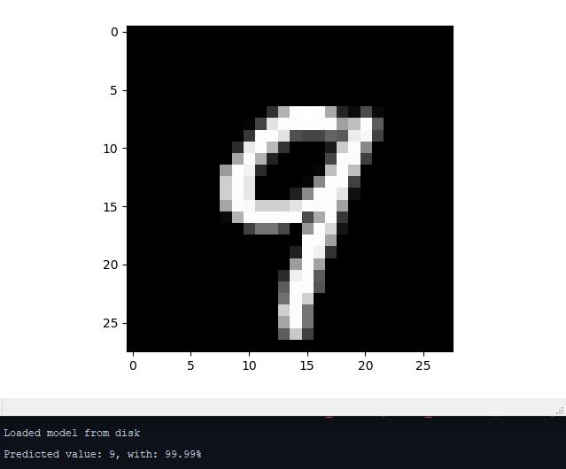

# CNN-MNIST
An example of CNN for Image Classification using MNIST data set

## Model: 

<p align="center">
  
</p>


An example of CNN for Image Classification using MNIST data set
# Model used: 
```
- Input (Gray Images 28*28) 
- Convolutional layer(Kernel = 32, Stride = 1, Padding = 1) 
- Pooling layer(2*2) 
- FLATTEN(14*14*32 nodes) 
- Fully connected layer 1 (128 nodes, activation: sigmoid function)
- Fully connected layer 2 (10 nodes for [0..9], activation: soft-max function)

```

## Train result:

<p align="center">
  
</p>

<p align="center">
  
</p>

## Test:
- To use trained model: 
```
  json_file = open('model.json', 'r')
  loaded_model_json = json_file.read()
  json_file.close()
  loaded_model = models.model_from_json(loaded_model_json)

```
<p align="center">
  
</p>
